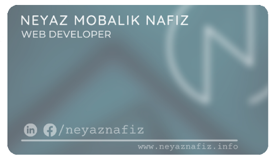

##

 
##

 

   ### 📫  *REACH ME OUT* ⇘ 

  

  &nbsp;
 &nbsp;
 &nbsp;
  &nbsp;
  &nbsp;
 
  <!-- IF YOU LIKE WHAT I DO, TAKE A LOOK AT MY **_<a href="https://www.neyaznafiz.info" target="_blank">PORTFOLIO</a>_** -->
  <!-- IF YOU LIKE WHAT I DO, TAKE A LOOK AT MY **_<a href="https://drive.google.com/file/d/1RJKQbna1BbNCASHx2zt32oz1uYC2_t0B/view?usp=sharing" target="_blank">RESUME</a>_** -->
 

##

  &nbsp;
 

 

### PRODUCT
 **_<a href="https://crates.io/crates/system_diskinfo" target="_blank">system_diskinfo</a>_**. A package for RUST programmers to collect information about disk drive means SSD/HDD etc of a windows operating system.

 ### WHAT I AM WORKING ON NOW...!
 Currently, I'm working on a POS software called "Queue". This software has some amazing features for managing your business.

 <!--  -->
 
 <!--  -->
 
 
 <!--  -->
 
<!--   -->
 
<!--  (https://github.com/DenverCoder1/github-readme-streak-stats) -->
<!--   -->
        
 
<!--  -->

<!--  &nbsp; -->

<!-- &nbsp; -->

<!-- &nbsp; -->

 

## *💻 My Recent Blog Post* ⇘

#### ➥ *[React component lifecycle.](https://dev.to/neyaznafiz/react-component-lifecycle-3pee)*
#### ➥ *[A Comprehensive Overview of Rust.](https://dev.to/neyaznafiz/--3lb0)*
#### ➥ *[Difference between SQL and NoSQL databases.](https://dev.to/neyaznafiz/difference-between-sql-and-nosql-databases-458j)*
#### ➥ *[Difference Between Local Storage And Session Storage in browser.](https://dev.to/neyaznafiz/difference-between-local-storage-and-session-storage-in-browser-1a5m)*

 <a href='https://dev.to/neyaznafiz'> ➦ CHECKOUT ALL BLOGS <a/>

 
 

## *💻 Technologies That I Know* ⇘
 

&nbsp;
&nbsp;
&nbsp;

 

&nbsp;
&nbsp;
&nbsp;

 

&nbsp;
&nbsp;
&nbsp;
&nbsp;
&nbsp;

 

&nbsp;
&nbsp;
&nbsp;
&nbsp;
&nbsp;
&nbsp;

 

&nbsp;
&nbsp;
&nbsp;
&nbsp;

<!-- 
 -->
